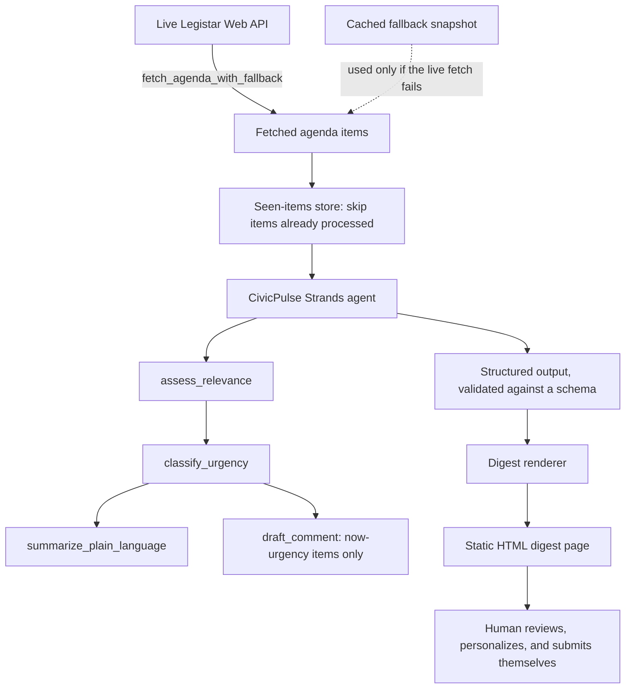

# CivicPulse

CivicPulse reads the agendas so your neighborhood doesn't have to, and only speaks up when there's a real decision on the table.

Built for the AWS "Agents for Humans" hackathon, Good Neighbor Agents track.

## The problem

Local government decides zoning, bike lanes, school budgets, and policing budgets: things that hit daily life harder than most federal policy. Almost nobody attends or reads city agendas anyway, because:

- Agendas are released on inconsistent schedules, often just days before a meeting.
- They are dense, jargon-heavy legal documents ("R-2 zoning density variance" instead of "apartment building near you").
- There is no way to filter for "does this affect my street or my specific concern" without reading everything.
- By the time someone notices an item matters, the public comment period has often closed.

Civic participation ends up skewed toward retirees, professional lobbyists, and people with a direct financial stake, not the broader neighborhood.

## Who this is for

- **Neighborhood association volunteers** who want to flag genuinely important city items to their list without reading every agenda from multiple local bodies.
- **Individual residents** who care about a couple of specific things (school funding, bike lane safety, a nearby zoning change) and want a single low-noise alert instead of parsing city government themselves.

This is not built for policy professionals or lobbyists who already monitor everything full time.

## What it does

CivicPulse is a single Strands agent that:

1. Ingests newly published agenda items for a real city (San Jose, CA, via the Legistar Web API).
2. Judges whether each item is relevant to a neighborhood group's stated priorities, using semantic reasoning rather than keyword matching, so an item can match a priority even when it shares no words with it, and a share-the-same-words item can correctly come back not relevant (a "reasonable accommodation" zoning item is disability access, not affordable housing).
3. Classifies urgency from the meeting date and whether the item is on the consent calendar, since being on consent changes what "actionable" even means (see below).
4. Summarizes relevant, time-sensitive items in plain language.
5. Drafts a neutral public-comment template for a human to personalize and submit themselves, only for items judged genuinely urgent.
6. Renders everything to a static, read-only digest page. Nothing is ever sent, posted, or submitted automatically.

Routine and non-time-sensitive items are grouped into a lower section of the digest instead of being surfaced as urgent. Only relevant items with a genuinely imminent, specific action are put at the top.

## Example: semantic reasoning, not keyword matching

A real agenda item from the live San Jose feed:

> **PP25-008, Title 20 Zoning Code Amendment, Reasonable Accommodation.**
> Matter 26-951, Land Use Consent Agenda, September 15, 2026 meeting.

The neighborhood profile carries `housing_affordability` and `housing_accessibility` as two separate, deliberately distinct priorities. A keyword filter would see "zoning" and other housing-adjacent language here and plausibly lump this item in with affordability. `assess_relevance`'s actual, unedited output on this item was:

```
matched_priorities: ["housing_accessibility"]
reasoning: "This is a zoning code amendment specifically addressing reasonable
accommodation, which directly relates to disability access and fair housing
compliance in land use, the core of the housing accessibility priority."
```

It did not match `housing_affordability`, because "reasonable accommodation" under the Fair Housing Amendments Act is a disability-access mechanism, not a general housing-supply or cost policy, despite sharing zoning and housing-adjacent language with that other priority. This is the specific case the project was built to demonstrate: two priorities that share vocabulary but mean different things, judged correctly on what the item actually does rather than what words it contains.

## What it deliberately does not do

- It does not submit public comments automatically. A human always reviews and sends.
- It does not support multiple cities in this version. One real city, done well.
- It does not take a political position. It explains what an item does and why it matches a stated priority, and is explicitly prompted to present trade-offs neutrally rather than advocate.
- It does not guarantee deadline accuracy. Every deadline-related claim links back to the primary agenda source with an explicit reminder to verify the date there.

## Architecture



Model: Claude on Amazon Bedrock. Persistence: a local SQLite store of previously seen agenda item IDs, so re-runs do not re-surface the same item. A single well-scoped agent with five tools is used instead of a multi-agent architecture; that is a deliberate scope decision for a short build, not a limitation discovered along the way.

## Design decisions and things to watch out for

- **Political neutrality is enforced in the prompts, not assumed.** `assess_relevance` is explicitly told to report when an item cuts both ways for a group's priorities (for example, a zoning change that helps affordability while adding parking pressure) rather than picking a side, and `draft_comment` is explicitly told to present trade-offs neutrally instead of advocating.
- **Deadlines are never treated as facts.** The city's own Legistar feed does not reliably expose structured public-comment deadlines, so `classify_urgency` reasons from the meeting date and consent status instead of a claimed deadline, every deadline-sensitive item links to the primary agenda source, and the digest carries an explicit reminder to verify dates there before acting.
- **Urgency judgments are anchored to an explicit reference date, never an assumed "today."** This matters specifically because of the fallback mechanism below: without it, a cached snapshot read a day or more after capture could confidently report a comment window as "still open" after it had actually closed.
- **A live-feed outage falls back to a real cached snapshot, and says so.** `fetch_agenda_with_fallback` tries the live San Jose feed first and only drops to `data/fallback/agenda_snapshot.json` if it is unreachable. The digest always states which source was used, and for a cached run, how stale it is; this needs to be visible on the page itself, not just in a log a presenter might not be looking at.
- **Consent-calendar items are not automatically urgent.** A consent item passes as part of a routine batch vote unless someone requests it be pulled for individual discussion, so `classify_urgency` was explicitly tuned so being on the consent calendar is never itself a reason to flag urgency; only a genuine signal of controversy or unusual impact in the item's own text is.
- **A prompt instruction alone was not trusted for the one invariant that most needed to hold.** The system prompt tells the model to draft a public comment only for "now"-urgency items, since a ready-to-send draft implies urgency an item may not have. But a model that can be talked around a prompt constraint under slightly different phrasing is a real reliability gap, and testing showed it happening. That invariant is therefore also enforced in code: a draft is discarded while rendering the digest if its item's urgency is not exactly "now," regardless of what the model produced.
- **The schema fields that most needed to be optional were made optional, not just discouraged.** Early testing showed that requiring `urgency_level` in the agent's final structured answer caused the model to invent an urgency judgment for every item just to satisfy the schema, including ones already found not relevant, roughly tripling the Bedrock calls needed for one run. Making those fields genuinely optional and telling the prompt explicitly that non-relevant items should never reach `classify_urgency` brought one real run from 70 tool calls down to 41 against the same batch of live items.
- **No emoji, no em dashes, anywhere the model's own text ends up.** The system prompt asks for this directly, and a small sanitizer strips both from every LLM-generated text field before it reaches the digest, since a prompt request is not a guarantee.
- **Known limitation: relevance matching is coarser for broad development-supply items than for specific subsidy or waiver items.** A generic "this authorizes new residential development, which affects housing supply" reading can match almost any residential land-use permit, diluting the precision the relevance story is built on; a named, specific mechanism (a targeted tax or fee waiver, a reasonable-accommodation provision) is judged with sharper confidence than a routine permit's generic contribution to supply. This surfaced on its own in a real run: an item's own drafted comment hedged that "this particular project may or may not directly address the need for housing that is affordable to lower- and middle-income residents," a more honest posture than the relevance judgment that had already escalated it to the same urgency tier as a named subsidy. A `match_strength` field (strong or weak), gating comment-drafting to strong matches only, is a natural next step, listed rather than rushed into on the day this was found.

## Data source

City of San Jose, CA, via the public Legistar Web API (`https://webapi.legistar.com/v1/sanjose/`). This is a real, live, publicly accessible data source, not a synthetic dataset. A snapshot of a real pull is kept at `data/fallback/agenda_snapshot.json`; if the live feed is ever unreachable, the agent automatically falls back to it so a demo never depends on the government site's uptime. Refresh it with `scripts/save_fallback_snapshot.py` before a demo.

## Setup and running it locally

Prerequisites: Python 3.11+, and an AWS account with Bedrock access to a Claude model (see the gotchas below; a brand-new AWS account needs a few one-time steps first).

```bash
git clone https://github.com/vaish725/civicpulse-agent.git
cd civicpulse-agent
python3 -m venv .venv
source .venv/bin/activate
pip install -r requirements.txt
aws configure   # access key, secret key, a region with Claude enabled (e.g. us-east-1), output=json
```

Check `src/civicpulse/config.py` and make sure `BEDROCK_MODEL_ID` and `BEDROCK_REGION` match a model actually enabled in your account (see gotcha 4 below), then run one ingestion pass:

```bash
PYTHONPATH=src python3 -m civicpulse.agent
```

This prints a live trace of the agent's reasoning to the console and writes `data/digest/latest.html`, the actual human review surface; open it in a browser. Running it again immediately after will report no new items, since seen items are tracked locally in `data/seen_items.sqlite3`.

To refresh the cached fallback snapshot used if the live feed is ever unreachable:

```bash
PYTHONPATH=src python3 scripts/save_fallback_snapshot.py
```

### AWS setup gotchas

None of these are specific to this project; they are standard friction points for any brand-new AWS account's first real use of Bedrock, documented here so they don't cost the next person the same hour they cost this one.

1. **Account verification.** New accounts go through an automatic fraud-prevention hold; Bedrock calls fail with an explicit "your account is currently being verified" error until it clears, usually within a couple of hours.
2. **Anthropic use-case details form.** The first time any AWS account calls an Anthropic model, Bedrock requires a one-time form (Bedrock console, Model catalog, open a Claude model) describing the intended use. It can take about 15 minutes to propagate after submitting.
3. **A valid payment method for AWS Marketplace specifically.** Anthropic's models on Bedrock are billed through AWS Marketplace, a separate payment system from an account's main billing preference. A bank-account-based default payment method (common outside the US) may not satisfy it; a credit or debit card does.
4. **The newest model release may need to be requested individually.** A model released very recently can lag behind older ones in an account's access, and current-generation Claude models need an inference profile ID (a `us.` prefix), not the bare model ID, for on-demand use. Run `aws bedrock list-inference-profiles --region <region>` to see what is actually usable in your account, and set that in `config.py`.
5. **A sudden, account-wide `ValidationException: Error 002: Access to Bedrock models is not allowed for this account`.** This is a known, separately reported issue distinct from the four above: it can appear on a previously-working account with no configuration change, blocks every model invocation while `ListFoundationModels` still succeeds, and has no self-service fix. It requires an AWS Support case (Account and Billing category, included on Basic support) for AWS staff to manually clear.

## Status

Core loop is complete and verified end to end against live data: ingestion, relevance and urgency judgment, plain-language summaries, neutral comment drafting, a fallback dataset for demo safety, and a rendered digest page.

Two correctness issues found by critical review on 2026-09-14 were fixed and verified the same day: `classify_urgency` was requiring a visible controversy signal before flagging a non-consent item as urgent, which is backwards (a routine-sounding title is exactly how a consequential real decision hides in a government agenda; that requirement now applies only to consent items, where it belongs), and the digest was hiding `matched_priorities` on every bucket except the top one, burying the project's clearest evidence of semantic reasoning over keyword matching. AWS Bedrock account-wide access issue Error 002 (gotcha 5 above) blocked live re-verification against a fresh run for part of that day; the fix was instead verified live through the Anthropic API path (`MODEL_PROVIDER=anthropic`, see below), the same tools and prompts, a different model provider. That run confirmed a real, non-consent, imminently-voted item (the Stevens Creek Blvd multifamily fee waiver) now correctly lands in "Now" with a drafted comment, and that `matched_priorities` is visible for the reasonable-accommodation item wherever it lands. A third item, spot-checking that per-item reasoning is not converging on templated phrasing, was also completed: five real not-relevant items were checked directly and each gave genuinely distinct, content-specific reasoning rather than boilerplate.

### Model provider fallback

Every reasoning tool's model call, and the top-level agent's own model, can run against Amazon Bedrock (the default, AWS-native path) or the Anthropic API directly, selected by `MODEL_PROVIDER` in a local `.env` file (see `.env.example`). This exists because Bedrock model invocation can be blocked by AWS-account-level issues entirely unrelated to this project's code, as happened during this build, and a second, independent path meant that outage did not block finishing verification. Bedrock remains the default and the AWS-native story this project is built around; the Anthropic path is a documented, tested fallback, not a replacement.

### On Bedrock AgentCore deployment

AgentCore is called out in the hackathon rules as strengthening, not requiring, the Technical Implementation score, and it was evaluated rather than skipped outright. `agentcore create --framework Strands --model-provider Bedrock` genuinely scaffolds a working Python Strands agent project, confirming the toolchain fits this stack. Two concrete things stopped a full deployment within the time available:

- Its deployment path is CDK-based: bootstrapping CDK, building and pushing a container to ECR, and creating IAM roles for the runtime. The IAM user used for this project is deliberately scoped to `AmazonBedrockFullAccess` only (confirmed unable to even read its own attached policies), and granting it CloudFormation, ECR, and IAM role-creation permissions is a real permission-scope decision, not a config change to make silently mid-build.
- The scaffolded entrypoint contract is built for a conversational, session-based streaming agent (chat-style, with MCP client support), while this project's core loop is a scheduled batch job; adapting one to the other is additional, separate work on top of the permissions question.

A Lambda/EventBridge daily schedule invoking `civicpulse.agent.run_once` is the equally legitimate deployment path this project actually uses conceptually (see `if __name__ == "__main__"` in `agent.py`), and is the natural next step for turning this into a real recurring service.

## License

MIT. See [LICENSE](LICENSE).
